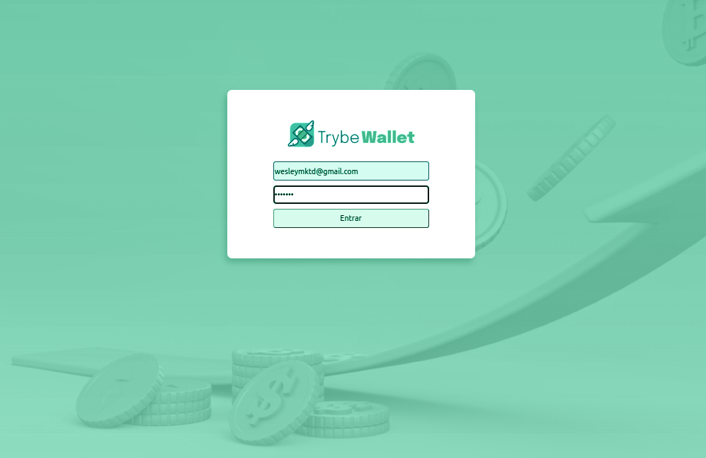
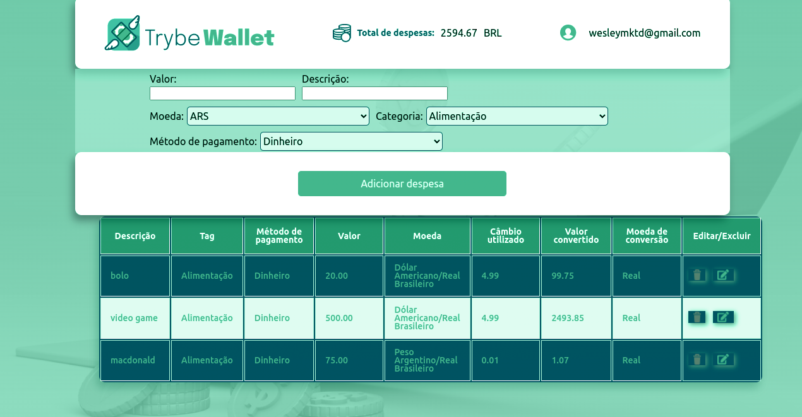

## 🧐 Sobre

<p align="left"> 
	Esse projeto se trata de uma carteira de controle de gastos com conversor de moedas, ao utilizar este aplicativo o usuário poderá:

- Adicionar, remover e editar uma despesa;
- Visualizar uma tabela com seus gastos;
- Visualizar o gasto total convertido em uma moeda de sua escolha;
</p>
<div align="center">


</div>

## ⚒ Instalando <a name = "installing"></a>

```bash
# Clone o projeto
$ git clone git@github.com:wesleymktd/project-trybewallet.git
# Acesse
$ cd ./project-trybewallet
# Instale as dependencias
$ npm install
# Inicie o projeto
$ npm start
# O servidor vai inicar na porta <http://localhost:3000>
```

## Principais tecnologias utilizadas:
- React;
- Redux:
- JavaScript:
- Css;
